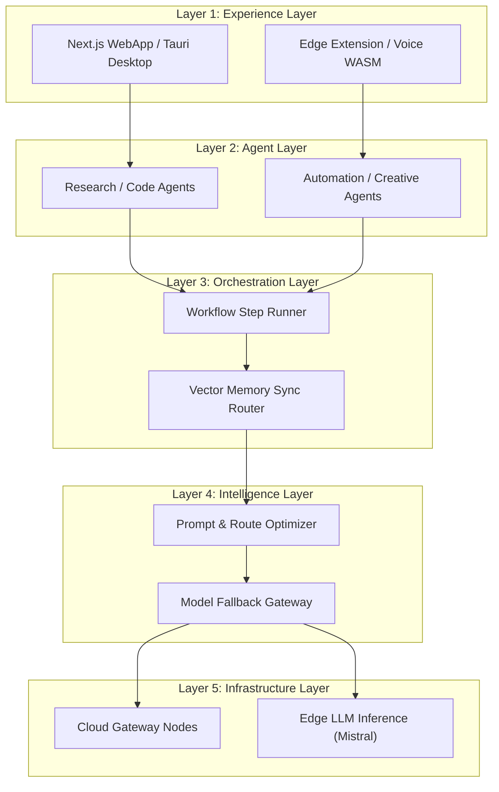

# Universal Cross-Platform Agentic AI Ecosystem (U-AIX)


U-AIX is a state-of-the-art, global AI Orchestration Platform and Agent Operating System that extends, combines, and routes queries dynamically across ChatGPT, Claude, Gemini, DeepSeek, and Edge LLMs. 

This repository contains the interactive U-AIX developer dashboard and visual system blueprint portal.

---

## 🚀 Key Features

* **Visual Agent Studio**: Drag-and-drop workflow canvas to chain models and skill packs with sequential pipeline highlights and running terminal simulation logs.
* **Intelligent Model Router**: Weight quality, latency, and cost priorities to dynamically target ideal API routes with dial telemetry.
* **Universal Memory Vector Sync**: TLS encrypted user-side synced context embeddings crossing ChatGPT, Claude, and local edge containers.
* **Architect Specs Sandbox**: Entity-relationship database schemas, Swagger-compliant interactive endpoint inputs, and multi-language SDK playground scripts.
* **Business Pitch Strategy**: Integrated pitch decks, 30/60/90 days MVP timelines, scaling topologies, and competitive matrix parameters.

---

## 🏛️ System Architecture Layers



---

## 📁 Repository Directory Structure

* [index.html](index.html) — DOM layout definitions, sidebar tabs navigation, slider interfaces, and modals.
* [index.css](index.css) — Custom HSL theme variables, scrollbars, canvas grids, glowing active nodes, dial SVG styles, and execution keyframes.
* [app.js](app.js) — Workspace drag handlers, SVG connector paths, simulated multi-agent execution routines, API sandboxes, and slide managers.
* [sdk-samples.js](sdk-samples.js) — Node.js and Python syntax highlights displaying skill registration and context syncing loops.

---

## 🔧 Developer Quickstart

To boot the U-AIX console locally:

1. Clone or open the workspace directory.
2. Initialize a static HTTP server:
   ```bash
   npx http-server -p 8080
   ```
3. Open `http://localhost:8080` in your web browser.

---

## 🔒 Security & Data Sovereignty

All vector cache coordinates are encrypted client-side using **AES-GCM-256** prior to remote sync. The central cloud orchestrator handles routing payloads without ever storing decrypted database values.
