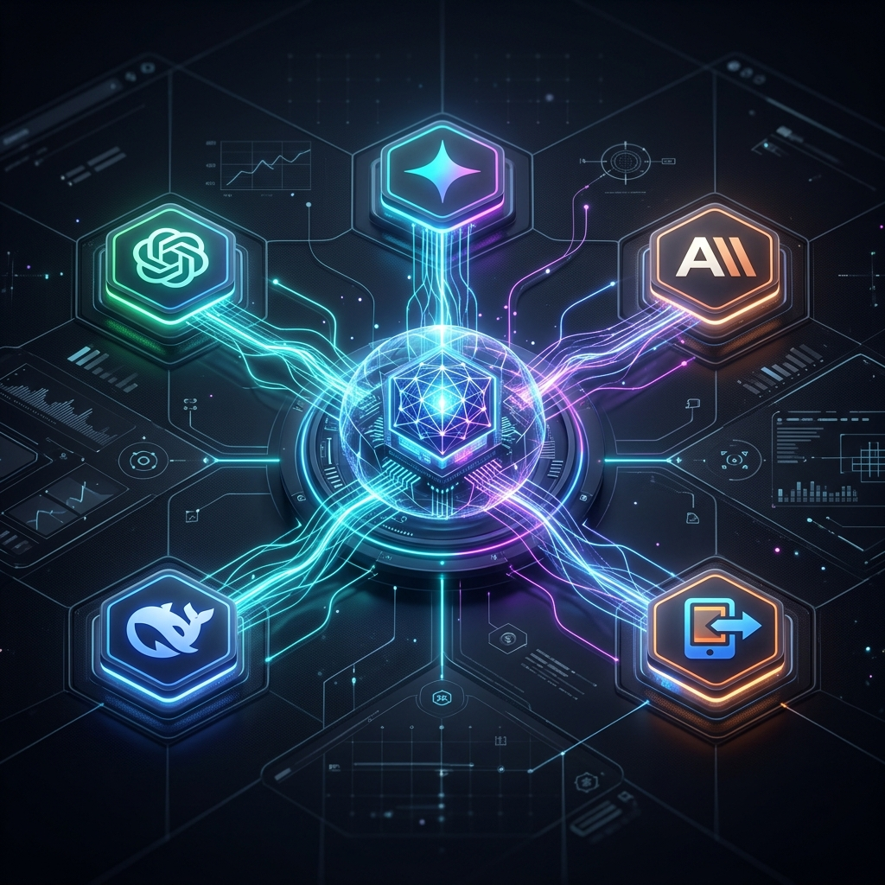
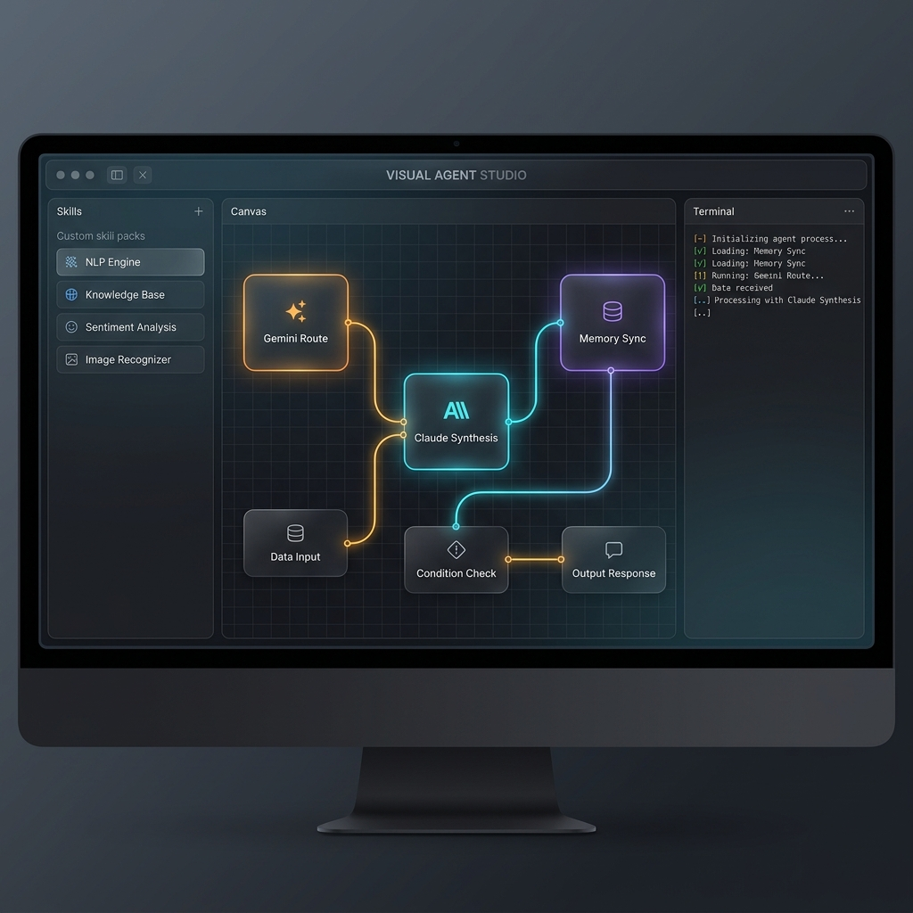
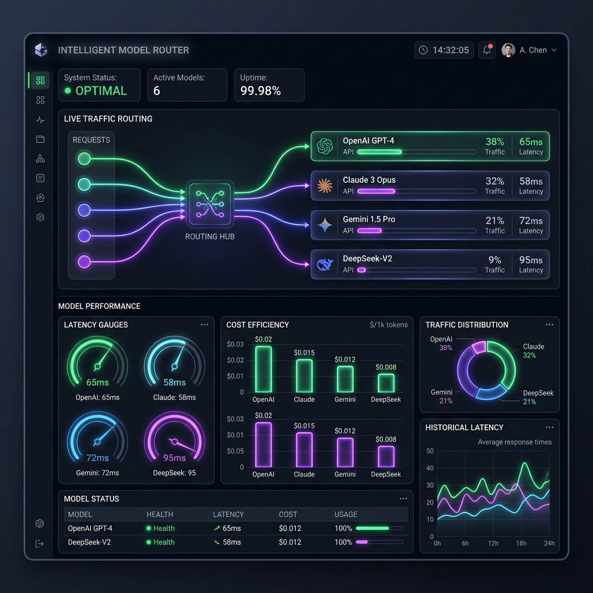
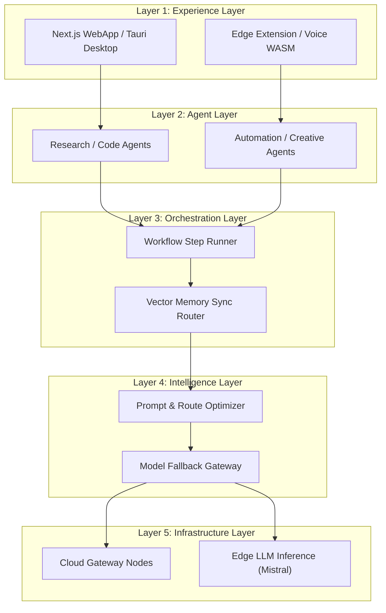

# 🌌 Universal Cross-Platform Agentic AI Ecosystem (U-AIX)



U-AIX is a state-of-the-art, global **AI Orchestration Platform** and **Agent Operating System** that dynamically routes, combines, and optimizes prompts across Gemini, Claude, ChatGPT, DeepSeek, and Edge LLMs. 

This repository contains the interactive U-AIX developer dashboard, visual blueprint studio, and multi-model router playground.

---

## ✨ Primary Visual Components

### 🎨 Visual Agent Studio
Build complex multi-agent workflows using a node-based interface. Chain capabilities, set memory brokers, and watch real-time flow execution highlights with detailed simulation logs.



### 🚦 Intelligent Model Router
Optimize your cost, latency, and capability score constraints. Dynamically direct requests to the most efficient model node with live telemetry dashboards.



---

## 🚀 Key Architectural Features

* **🧠 Hybrid Memory Sync:** TLS-encrypted, local-first context syncing across ChatGPT, Claude, and edge models.
* **⚡ Visual Orchestrator:** Drag-and-drop workflow canvas showing active state transitions and message routing.
* **🛡️ Security Shield:** AES-GCM-256 client-side encryption of context embeddings before any cloud sync.
* **🛠️ Spec Sandbox:** Swagger-compliant endpoints and interactive SDK playground supporting Node.js and Python.
* **📊 Business Intelligence:** Embedded MVP timeline (30/60/90 days), competitive matrices, and multi-layer network topologies.

---

## 🏛️ System Architecture Layers



---

## 📁 Repository Directory Structure

* 📄 [index.html](index.html) — DOM structures, sidebar tab controls, interactive dials, and modal containers.
* 🎨 [index.css](index.css) — Custom HSL theme variables, scrollbar stylings, node canvas grids, and glow animations.
* ⚙️ [app.js](app.js) — Mouse drag events, canvas line drawings, mock pipeline runs, router metrics, and slide controllers.
* 🐍 [sdk-samples.js](sdk-samples.js) — Code highlights showing Python & JavaScript SDK integration interfaces.

---

## 🔧 Developer Quickstart

To run the U-AIX console locally in your web browser:

1. Clone this repository to your computer.
2. Launch a local static HTTP server in the root directory:
   ```bash
   npx http-server -p 8080
   ```
3. Open [http://localhost:8080](http://localhost:8080) in your web browser.

> [!IMPORTANT]
> Make sure you have Node.js installed to run `npx`. If you don't have Node.js, you can open `index.html` directly in your browser, though some async assets might require a local origin.

---

## 🔒 Security & Data Sovereignty

> [!NOTE]
> All vector cache data coordinates are encrypted client-side using **AES-GCM-256** prior to remote sync. The central cloud orchestrator routes payloads without ever having visibility of your raw decrypted keys or context credentials.
